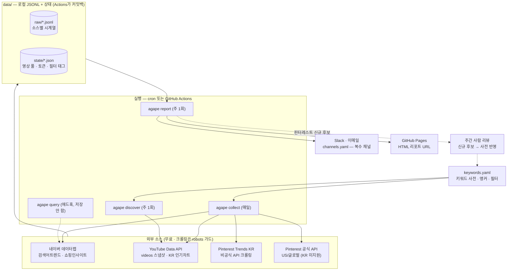

# agape — SNS 기반 헤어 트렌드 감지 (저비용 MVP)

네이버 데이터랩 + YouTube Data API + Pinterest Trends의 **무료 데이터만으로** 한국 헤어
키워드의 급등 시그널을 주간 단위로 감지하는 파이프라인. 운영 비용 목표는 월 $10 이하
(실제 API 비용 $0).

독립 레포·독립 uv 환경으로 동작한다 (자체 `pyproject.toml` + `.venv` — 어떤 모노레포에도
의존하지 않음). 서버 없이 로컬 cron 또는 GitHub Actions로 돌린다.

## 아키텍처



- **집계**: `agape report`가 DuckDB로 JSONL을 직접 읽어 주간 WoW · z-score · YoY를 계산하고
  시그널(강한 후보/관찰/계절성 의심)을 판정한다 — 별도 DB 없음.
- **점선 루프**: 리포트가 발굴한 사전 미등록 급상승 키워드를 사람이 주 1회 검토해
  `keywords.yaml`에 추가하면 다음 수집부터 자동 추적된다.

## 설계 요약

- **원칙**: 절대량이 아니라 "평소 대비 급등"을 잡는다. 소셜(유튜브)=선행 신호,
  검색(네이버)=확인 신호로 크로스 체크한다.
- **메트릭**: 주간 볼륨, WoW 성장률(velocity), 4주 이동평균 대비 z-score, 전년 동기비(YoY).
  - z ≥ 2 & WoW ≥ +15% & 유튜브 동반 상승 → **강한 후보**
  - z ≥ 2 이지만 YoY < +50% → **계절성 의심** (작년에도 이맘때 올랐던 키워드)
- **네이버 데이터랩 ratio 주의**: 요청 내 최대값=100인 상대값이라 요청 간 비교 불가.
  모든 배치에 앵커 키워드(`keywords.yaml`의 `anchor`)를 끼워 앵커 평균으로 나눠 재보정한다.
- **유튜브 쿼터 절약**: 비싼 search.list(100유닛)는 주 1회 discovery에서 키워드 순환으로만 사용.
  일일 스냅샷은 videos.list(1유닛/50개)로 조회수 증분(Δviews)을 직접 시계열화한다.
- **핀터레스트 (KR, 크롤링)**: trends.pinterest.com의 내부 API에서 KR 지역 키워드 시계열
  (WoW/MoM/YoY 제공)과 급상승 톱50을 수집한다. 로그인 불필요한 공개 집계 데이터지만
  **비공식 API**라 언제든 깨질 수 있다 — 실패해도 다른 소스에 영향 없음. 급상승 톱50 중
  사전에 없는 헤어 키워드는 리포트에 "신규 후보"로 표시되어 수동 발굴을 대체한다.
- **핀터레스트 (US/글로벌, 공식 API)**: `collectors/pinterest_official.py`. 공식 Trends API로
  `topics/featured`(관심사=beauty 트렌딩 토픽)와 `product_categories/trending`을 수집한다.
  안정적·합법적이라 글로벌 **선행 신호**용. **공식 API는 KR을 지원하지 않아**(US/EU/중남미만)
  한국 데이터는 위 크롤러가 담당하고 이 소스는 US 등 글로벌만 본다. client_credentials
  방식이라 OAuth 리다이렉트가 필요 없지만, Trends 데이터 접근은 Pinterest 파트너 승인이
  필요할 수 있다(미승인 시 403 → 자동 스킵).

### 핀터레스트 인증 설정 (선택)

한국 크롤러는 인증 없이 동작하므로 아래는 전부 선택이다 (`.env`):

- **공식 API**: `developers.pinterest.com`에서 앱 생성 → `PINTEREST_APP_ID` / `PINTEREST_APP_SECRET`.
  조회 대상은 `PINTEREST_OFFICIAL_REGION`(기본 US) / `PINTEREST_OFFICIAL_INTEREST`(기본 beauty).
  토큰은 `data/state/pinterest_official_token.json`에 캐시되고 만료 시 자동 갱신된다.
- **KR 크롤러 인증**: 차단이 잦거나 세션이 필요할 때만 `PINTEREST_COOKIE`(브라우저 Cookie 헤더),
  `PINTEREST_CRAWLER_UA`(요청 UA 덮어쓰기)를 설정. UA는 robots 판정과 실제 요청에 동일 적용된다.

## 크롤링 원칙 (robots.txt 가드)

크롤링 수집기는 요청 전에 반드시 `robots.py`의 `RobotsGuard.ensure_allowed(url)`를
통과해야 한다. 판정은 RFC 9309를 따른다:

- robots.txt가 있으면 파싱해서 우리 UA(`agape-trendbot/0.1`) 기준으로 준수 — 금지 경로면 수집 중단
- 404 등 4xx → robots.txt 없음 = 제한 없음
- 5xx/네트워크 오류 → **전체 비허용으로 간주하고 수집 중단** (fail-closed)

robots 판정과 실제 요청에 동일한 정직한 봇 UA를 사용하고, 요청 간 1초 이상 간격을 둔다.
네이버·유튜브는 공식 API 호출이므로 이 가드의 대상이 아니다. 새 크롤링 소스를 추가할 때도
같은 가드를 반드시 붙일 것.

## 시작하기

```bash
cd agape
uv sync                     # .venv 생성 + 의존성 설치
cp .env.example .env        # API 키 채우기
```

API 키 발급:

- **네이버**: <https://developers.naver.com/apps> 에서 앱 등록 → 데이터랩(검색어트렌드),
  데이터랩(쇼핑인사이트) API 추가 → Client ID/Secret. 무료, 일 1,000회.
- **유튜브**: Google Cloud Console에서 프로젝트 생성 → YouTube Data API v3 활성화 → API 키.
  무료, 일 10,000유닛.

## 사용법

```bash
uv run agape discover   # 최초 1회 + 매주: 유튜브에서 추적할 영상 풀 구축 (~1,000유닛)
uv run agape collect    # 매일: 네이버 트렌드 + 유튜브 조회수 스냅샷 + KR 인기차트 + 핀터레스트
uv run agape report          # 매주: 급등 키워드 리포트 (표준출력)
uv run agape report --send   # + channels.yaml의 enabled 채널로 전송 (Slack/이메일)
uv run agape query ...       # 애드혹 조회 (저장 안 함) — 아래 참고
```

## 리포트 전송 (Slack · 이메일)

전송 대상은 `channels.yaml`에서 관리한다. Slack·이메일을 **여러 개** 등록할 수 있고,
비밀정보(webhook URL, SMTP 비밀번호)는 `.env`에 둔다.

```bash
cp channels.example.yaml channels.yaml   # 편집 (channels.yaml은 git 커밋 제외)
```

```yaml
# channels.yaml — 보낼 채널만 enabled: true
channels:
  - type: slack
    name: team-slack
    enabled: true
    webhook_env: SLACK_WEBHOOK_URL   # .env의 이 변수 URL 사용
  - type: email
    name: team
    enabled: true
    to: [lead@example.com, designer@example.com]   # 수신자 복수 가능
```

- 이메일은 `.env`의 `SMTP_*`로 발송한다(Gmail이면 앱 비밀번호 필요). 마크다운 리포트를
  표가 살아있는 HTML + 플레인텍스트 두 형식으로 보낸다.
- `agape report --send` = enabled 채널 전부, `--send --only me,team-slack` = 특정 채널만,
  `--quiet` = 표준출력 없이 전송만. 한 채널이 실패해도 나머지는 전송된다.

## 필터: 기간 · 기기 · 성별 · 연령

**애드혹 조회 (`agape query`)** — 저장하지 않고 즉석에서 조건을 바꿔 비교한다. 키워드를
한 요청에 넣으므로 키워드 간 상대값 직접 비교가 가능하다 (최대 5개):

```bash
uv run agape query 허쉬컷,히피펌                                   # 최근 1년, 주간
uv run agape query 허쉬컷 --start 2024-01-01 --end 2026-07-19 --unit month
uv run agape query 레이어드컷,울프컷 --gender f --ages 20,30        # 20~30대 여성
uv run agape query 다운펌 --device mo --gender m                   # 모바일 · 남성
```

**파이프라인 전역 필터** — `keywords.yaml`의 `filters:`에 설정하면 일일 수집
(검색어트렌드+쇼핑인사이트) 전체에 적용된다. 예: 20~30대 여성만 추적하려면
`device: ""` / `gender: f` / `ages: ["20", "30"]`. 필터를 바꾸면 상대값 스케일이
달라지므로 자동으로 재백필되고 이전 필터의 데이터는 집계에서 제외된다(데이터에
필터 태그가 저장됨). 연령은 십대 단위("10"~"60")로 입력하며, 검색어트렌드 API의
세부 구간으로 자동 변환된다 — "10"은 13~18세 구간 근사임에 주의.

첫 `collect`는 네이버 데이터를 2년치 백필하므로 z-score와 YoY가 즉시 계산된다.
유튜브는 과거 조회수를 제공하지 않아 스냅샷 2주치가 쌓여야 WoW가 나온다.

로컬/서버 cron 예시 (매일 08:00 수집, 월요일 08:30 discovery + 리포트):

```cron
0 8 * * *  cd /path/to/agape && uv run agape collect
30 8 * * 1 cd /path/to/agape && uv run agape discover && uv run agape report --send --quiet
```

## GitHub Actions로 무료 자동화 (서버 불필요)

`.github/workflows/agape.yml`이 매일 `collect`(데이터 누적), 매주 월요일 `discover + report`를
돌리고 리포트를 **GitHub Pages URL로 게시**한다. 상태(`data/`)는 실행 끝에 레포로 커밋백되어
다음 실행이 이어받는다. 무료 한도 안에서 완전 무료(퍼블릭 무제한 / 프라이빗 월 2,000분,
이 작업은 월 100분 미만).

워크플로 파일은 레포 루트 `.github/workflows/`에 있다 (이 프로젝트가 곧 레포 루트라는 전제 —
모노레포의 하위 디렉토리로 넣으면 GitHub이 워크플로를 인식하지 못한다).

일회성 세팅:

1. 이 프로젝트를 GitHub 레포로 푸시.
2. **Settings → Secrets and variables → Actions → Secrets**에 키 등록:
   `NAVER_CLIENT_ID`, `NAVER_CLIENT_SECRET`, `YOUTUBE_API_KEY`,
   (선택) `PINTEREST_APP_ID/SECRET`, `SLACK_WEBHOOK_URL`, `SMTP_HOST/PORT/USER/PASSWORD/FROM`.
3. (선택) 이메일/슬랙 전송하려면 **Variables**에 `CHANNELS_YAML`을 추가하고 `channels.yaml`
   내용을 그대로 붙여넣기 (수신자 이메일을 레포에 커밋하지 않기 위함).
4. 리포트 URL을 원하면 **Settings → Pages → Source = GitHub Actions** 로 한 번 지정.
5. Actions 탭에서 "Run workflow"로 수동 실행해 첫 데이터를 만들 수 있다.

### 공개 → 비공개 전환

- **Settings → General → Change visibility** 하나로 코드·데이터·Pages가 함께 비공개가 된다.
- Pages는 **비공개 레포에서 GitHub Pro가 필요**하다:
  - Pro가 있으면 Pages 방문 권한을 "private(멤버 전용)"로 두면 URL이 그대로 유지된다.
  - Pro가 없으면 **레포 변수 `PUBLISH_PAGES=false`** 만 설정 → Pages 단계는 건너뛰고
    `collect`/`report`/Slack/이메일은 그대로 동작한다. (Pages URL 대신 Slack/이메일로 수신.)
- 즉 전환은 "가시성 변경" + (필요 시) "변수 하나"로 끝난다.

## 키워드 사전

`keywords.yaml`에서 관리한다. 새 트렌드 후보(틱톡 Creative Center, 유튜브 인기차트에서
발견한 신조어)를 여기에 추가하면 다음 수집부터 추적된다. `synonyms`는 네이버 검색어 그룹에
함께 묶여 표기 변형을 흡수하고, `shopping: true`는 쇼핑인사이트 클릭 트렌드도 수집한다.

## 데이터 레이아웃

```
data/
├── raw/
│   ├── naver_search/YYYY-MM-DD.jsonl    # keyword, date, ratio, ratio_adj(앵커 보정)
│   ├── naver_shopping/YYYY-MM-DD.jsonl  # 카테고리/키워드 클릭 트렌드
│   ├── youtube_stats/YYYY-MM-DD.jsonl   # video_id별 조회수 스냅샷
│   ├── youtube_trending/YYYY-MM-DD.jsonl
│   ├── pinterest_metrics/YYYY-MM-DD.jsonl  # KR 키워드별 주간 시계열 + WoW/MoM/YoY
│   ├── pinterest_top/YYYY-MM-DD.jsonl      # KR 급상승 톱50 (+사전 미등록 후보)
│   ├── pinterest_official_topics/*.jsonl   # 공식 API: US/글로벌 트렌딩 토픽
│   └── pinterest_official_categories/*.jsonl  # 공식 API: 성장 쇼핑 카테고리
└── state/
    ├── youtube_video_pool.json          # 추적 중인 영상 풀 (keyword 매핑 포함)
    ├── pinterest_last_end_date.json     # 주간 데이터 갱신 감지용 (중복 수집 방지)
    └── pinterest_official_token.json    # 공식 API 액세스 토큰 캐시 (자동 갱신)
```

동일 (keyword, date)가 여러 파일에 중복되면 조회 시 `fetched_at` 최신본만 사용하므로
재수집·백필이 안전하다(멱등). 집계는 DuckDB가 JSONL을 직접 읽어 수행한다 — 별도 DB 없음.

## 쿼터/비용 계산 (키워드 60개 기준)

| 항목 | 사용량 | 한도 대비 |
|---|---|---|
| 네이버 데이터랩 | 일 ~17회 (검색 15배치 + 쇼핑 2배치) | 1,000회의 2% |
| 유튜브 collect | 일 ~80유닛 (풀 4,000개 스냅샷 + 차트) | 10,000유닛의 1% |
| 유튜브 discover | 주 ~1,000유닛 (search 10회) | 주 1회만 |
| 핀터레스트 | 주 ~6요청 (데이터 갱신 시에만) | $0, 무제한 아님 주의 |
| 스토리지 | 월 ~수십 MB (로컬) | $0 |
